---
## Front matter
title: "Лабораторная работа №8"
subtitle: "Программирование цикла.
 Обработка аргументов командной строки."
author: "Демин Даниил"

## Generic otions
lang: ru-RU
toc-title: "Содержание"

## Bibliography
bibliography: bib/cite.bib
csl: pandoc/csl/gost-r-7-0-5-2008-numeric.csl

## Pdf output format
toc: true # Table of contents
toc-depth: 2
fontsize: 12pt
linestretch: 1.5
papersize: a4
documentclass: scrreprt
## I18n polyglossia
polyglossia-lang:
  name: russian
  options:
	- spelling=modern
	- babelshorthands=true
polyglossia-otherlangs:
  name: english
## I18n babel
babel-lang: russian
babel-otherlangs: english
## Fonts
mainfont: IBM Plex Serif
romanfont: IBM Plex Serif
sansfont: IBM Plex Sans
monofont: IBM Plex Mono
mathfont: STIX Two Math
mainfontoptions: Ligatures=Common,Ligatures=TeX,Scale=0.94
romanfontoptions: Ligatures=Common,Ligatures=TeX,Scale=0.94
sansfontoptions: Ligatures=Common,Ligatures=TeX,Scale=MatchLowercase,Scale=0.94
monofontoptions: Scale=MatchLowercase,Scale=0.94,FakeStretch=0.9
mathfontoptions:
## Biblatex
biblatex: true
biblio-style: "gost-numeric"
biblatexoptions:
  - parentracker=true
  - backend=biber
  - hyperref=auto
  - language=auto
  - autolang=other*
  - citestyle=gost-numeric
## Pandoc-crossref LaTeX customization
figureTitle: "Рис."
tableTitle: "Таблица"
listingTitle: "Листинг"
## Misc options
indent: true
header-includes:
  - \usepackage{indentfirst}
  - \usepackage{float} # keep figures where there are in the text
  - \floatplacement{figure}{H} # keep figures where there are in the text
---

# Цель работы

Целью работы является приобретение навыков написания программ с использованием циклов и обработкой
аргументов командной строки.

# Выполнение лабораторной работы
Создал и перешел в директорию для лабораторной работы. Создал файл lab7-8.asm (рис. [-@fig:001]).

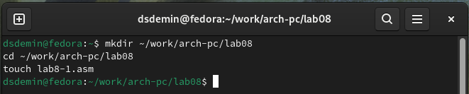{#fig:001 width=70%}

Переписал код с лабараторной работы(рис. [-@fig:002]).

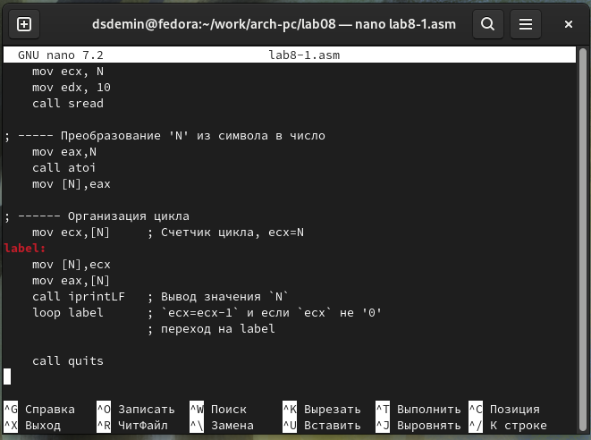{#fig:002 width=70%}

Листинг кода:

```
;-----------------------------------------------------------------
; Программа вывода значений регистра 'ecx'
;-----------------------------------------------------------------


%include 'in_out.asm'

SECTION .data
    msg1 db 'Введите N: ',0h

SECTION .bss
    N: resb 10

SECTION .text
    global _start
_start:

; ----- Вывод сообщения 'Введите N: '
    mov eax,msg1
    call sprint

; ----- Ввод 'N'
    mov ecx, N
    mov edx, 10
    call sread

; ----- Преобразование 'N' из символа в число
    mov eax,N
    call atoi
    mov [N],eax

; ------ Организация цикла
    mov ecx,[N] ; Счетчик цикла, `ecx=N`
    
label:
    mov [N],ecx
    mov eax,[N]
    call iprintLF   ; Вывод значения `N`
    loop label      ; `ecx=ecx-1` и если `ecx` не '0'
                    ; переход на `label`
    call quit
```

Создала и запустил исполняемый файл. (рис. [-@fig:003]).

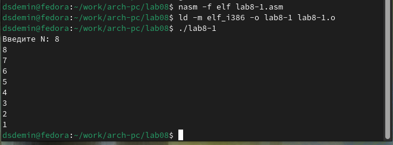{#fig:003 width=70%}	

Заменил часть кода на другой из лабараторной работы.

Листинг кода:

```
; Программа вывода значений регистра 'ecx'
;-----------------------------------------------------------------


%include 'in_out.asm'

SECTION .data
    msg1 db 'Введите N: ',0h

SECTION .bss
    N: resb 10

SECTION .text
    global _start
_start:

; ----- Вывод сообщения 'Введите N: '
    mov eax,msg1
    call sprint

; ----- Ввод 'N'
    mov ecx, N
    mov edx, 10
    call sread

; ----- Преобразование 'N' из символа в число
    mov eax,N
    call atoi
    mov [N],eax

; ------ Организация цикла
    mov ecx,[N]  ; Счетчик цикла, `ecx=N`
label:
 sub ecx,1
 mov [N],ecx
 mov eax,[N]
 call iprintLF
 loop label
    ; переход на `label`

    call quit
```

Создал и запустил исполняемый файл. Созданный цикл не принимает всех ожидаемых значений, кол-во проходов отличается от заданного в аргументе. (рис. [-@fig:004]).

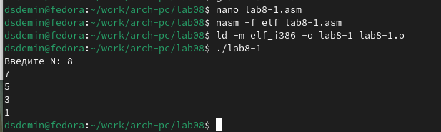{#fig:004 width=70%}

Добавил изменение значение регистра ecx в цикле.
 
Листинг кода:

```
;-----------------------------------------------------------------
; Программа вывода значений регистра 'ecx'
;-----------------------------------------------------------------


%include 'in_out.asm'

SECTION .data
    msg1 db 'Введите N: ',0h

SECTION .bss
    N: resb 10

SECTION .text
    global _start
_start:

; ----- Вывод сообщения 'Введите N: '
    mov eax,msg1
    call sprint

; ----- Ввод 'N'
    mov ecx, N
    mov edx, 10
    call sread

; ----- Преобразование 'N' из символа в число
    mov eax,N
    call atoi
    mov [N],eax

; ------ Организация цикла
    mov ecx,[N] ; Счетчик цикла, `ecx=N`
label:
	push ecx ; добавление значения ecx в стек
	sub ecx,1
	mov [N],ecx
	mov eax,[N]
	call iprintLF
	pop ecx ; извлечение значения ecx из стека
	loop label
    ; переход на `label`
    
    call quit
```

Создал и запустила исполняемый файл. Теперь регистр принимает значения с на еденицу меньше значения аргумента и до 0. Число проходов цикла соответствует введенному с клавиатуры. (рис. [-@fig:005]).

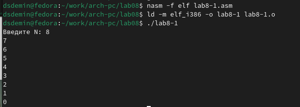{#fig:005 width=70%}

Создал новый файл и переписал в него код из лабараторной работы. ( рис. [-@fig:006]).

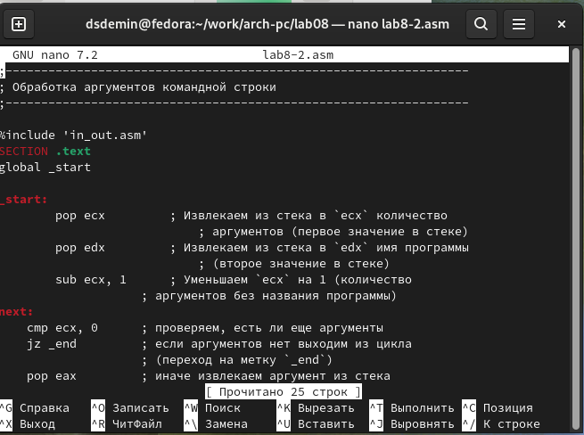{#fig:006 width=70%}

Листинг кода:

```
;-----------------------------------------------------------------
; Обработка аргументов командной строки
;-----------------------------------------------------------------

%include 'in_out.asm'
SECTION .text
global _start

_start:
	pop ecx         ; Извлекаем из стека в `ecx` количество
		            ; аргументов (первое значение в стеке)
	pop edx         ; Извлекаем из стека в `edx` имя программы
		            ; (второе значение в стеке)
	sub ecx, 1      ; Уменьшаем `ecx` на 1 (количество
                    ; аргументов без названия программы)
next:
    cmp ecx, 0      ; проверяем, есть ли еще аргументы
    jz _end         ; если аргументов нет выходим из цикла
                    ; (переход на метку `_end`)
    pop eax         ; иначе извлекаем аргумент из стека
    call sprintLF   ; вызываем функцию печати
    loop next       ; переход к обработке следующего
                    ; аргумента (переход на метку `next`)
_end:
    call quit
```

Создал и запустил исполняемый файл. Программой было отработано 4 аргумента (рис. [-@fig:007]).

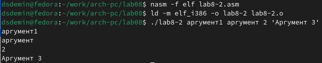{#fig:007 width=70%}

Создал новый файл и переписал в него код из лабараторной работы. рис. [-@fig:008]).

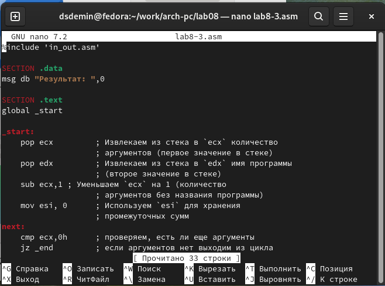{#fig:008 width=70%}

Листинг кода:

```
%include 'in_out.asm'

SECTION .data
msg db "Результат: ",0

SECTION .text
global _start

_start:
    pop ecx         ; Извлекаем из стека в `ecx` количество
                    ; аргументов (первое значение в стеке)
    pop edx         ; Извлекаем из стека в `edx` имя программы
                    ; (второе значение в стеке)
    sub ecx,1 ; Уменьшаем `ecx` на 1 (количество
                    ; аргументов без названия программы)
    mov esi, 0      ; Используем `esi` для хранения
                    ; промежуточных сумм
next:
    cmp ecx,0h      ; проверяем, есть ли еще аргументы
    jz _end         ; если аргументов нет выходим из цикла
                    ; (переход на метку `_end`)
    pop eax         ; иначе извлекаем следующий аргумент из стека
    call atoi       ; преобразуем символ в число
    add esi,eax     ; добавляем к промежуточной сумме
                    ; след. аргумент `esi=esi+eax`
    loop next       ; переход к обработке следующего аргумента
    
_end:
    mov eax, msg    ; вывод сообщения "Результат: "
    call sprint
    mov eax, esi    ; записываем сумму в регистр `eax`
    call iprintLF   ; печать результата
    call quit       ; завершение программы
```

Создал исполняемый файл и запустил его. Проверил с несколькими введенными числыми. (рис. [-@fig:009]).

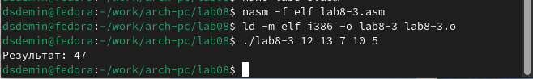{#fig:009 width=70%}

# Выполнение самостоятельной работы

Написал программу, которая выполняет вычисления для 8 варианта задания f(x)= 7+2x (рис. [-@fig:010]).

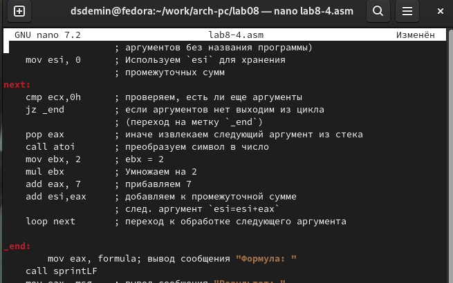{#fig:010 width=70%}

Запустил программу, и проверил работу с различными аргументами (рис. [-@fig:011]).

Листинг кода самостоятельной работы:

```
%include 'in_out.asm'

SECTION .data
msg db "Результат: ",0
formula db "Формула:  f(x)=7+2x",0

SECTION .text
global _start

_start:
    pop ecx         ; Извлекаем из стека в `ecx` количество
                    ; аргументов (первое значение в стеке)
    pop edx         ; Извлекаем из стека в `edx` имя программы
                    ; (второе значение в стеке)
    sub ecx,1 	    ; Уменьшаем `ecx` на 1 (количество
                    ; аргументов без названия программы)
    mov esi, 0      ; Используем `esi` для хранения
                    ; промежуточных сумм
next:
    cmp ecx,0h      ; проверяем, есть ли еще аргументы
    jz _end         ; если аргументов нет выходим из цикла
                    ; (переход на метку `_end`)
    pop eax         ; иначе извлекаем следующий аргумент из стека
    call atoi       ; преобразуем символ в число
    mov ebx, 2      ; ebx = 2
    mul ebx         ; Умножаем на 2
    add eax, 7      ; прибавляем 7
    add esi,eax     ; добавляем к промежуточной сумме
                    ; след. аргумент `esi=esi+eax`
    loop next       ; переход к обработке следующего аргумента

_end:
	mov eax, formula; вывод сообщения "Формула: "
    call sprintLF
    mov eax, msg    ; вывод сообщения "Результат: "
    call sprint
    mov eax, esi    ; записываем сумму в регистр `eax`
    call iprintLF   ; печать результата
    call quit       ; завершение программы
```

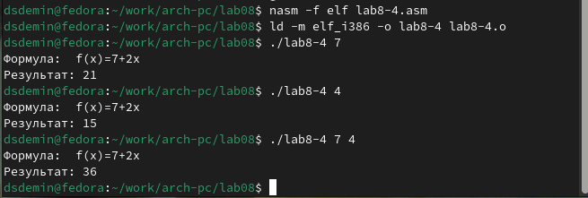{#fig:011 width=70%}

# Выводы
Выполнив данную лабараторную работу, я обрел навыки написания программ с использованием циклов и обработкой
аргументов командной строки.
